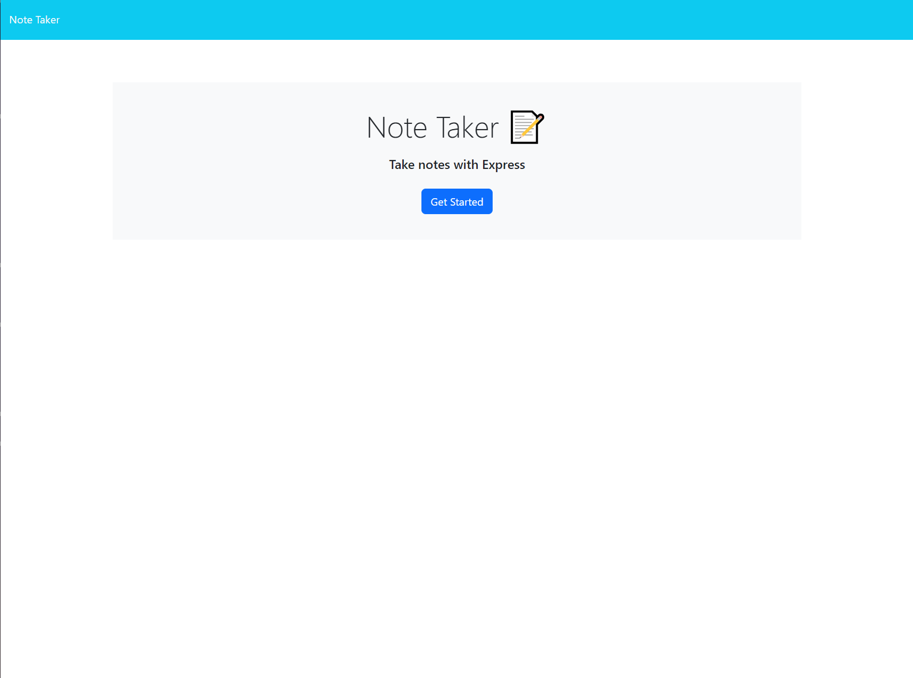
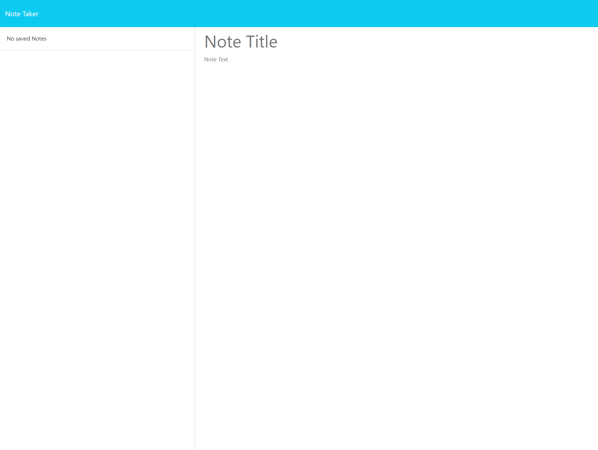
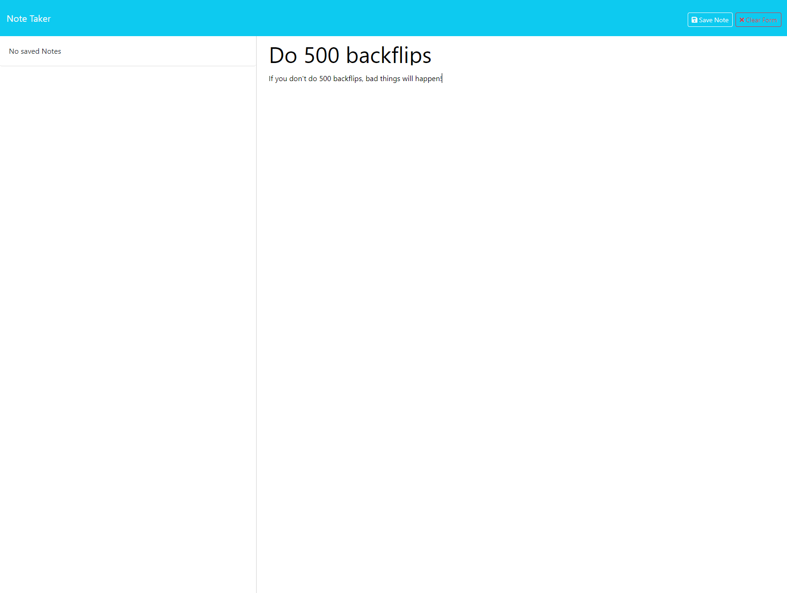
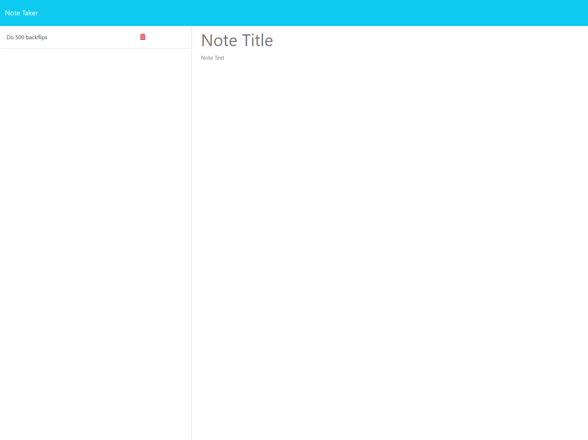
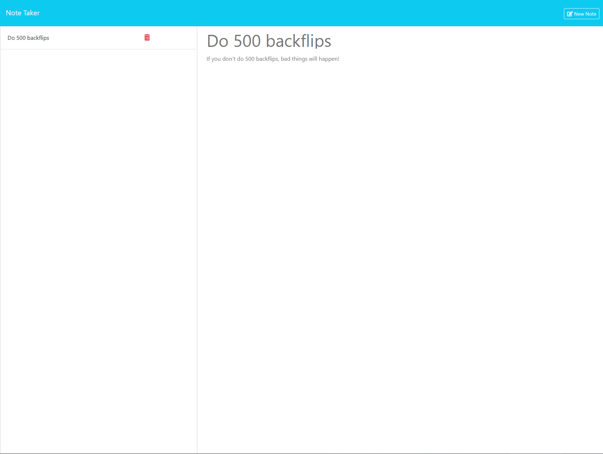

# note-taker

## Description

Note Taker is a lightweight web application that allows you to post notes to remind yourself of things to do!

- Opposed to previous projects of mine, this project stores data through an Express/Heroku cloud server!

- This means that whatever notes you make, everyone else can also make! (Please don't post this publically or I will have to spend millions :( )

## Installation

Note Taker can be used through any modern browser. It should run flawlessly with no errors (HOPEFULLY)

## Usage

Upon entering Note Taker, this is the screen you will be greeted with.

Click "Get Started" to enter the application.

This is the Note Taker application, to take a note, click on the "Note Title" and "Note Text" placeholders respectively to enter your note.

To save your note, press "Save Note" in the top right corner, alternatively, if you'd like to clear your note, press "Clear Form" located next to the "Save Note" button.

Once your note is saved, it will appear in the column to the left.

Note being displayed upon clicking:

The red trashcan icon will delete a note that you have taken.

## Credits

Various Stack Overflow Forums: https://stackoverflow.com/

